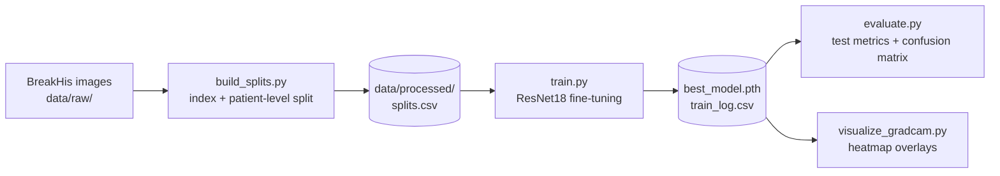

<div align="center">

# 🔬 Breast Cancer Histopathology Classifier

**Benign vs. malignant classification of breast tissue microscopy images with a fine-tuned ResNet18, trained on BreakHis and explained with Grad-CAM.**


</div>

> [!WARNING]
> This is a learning and research project. It is **not** a validated medical device and must not be used for clinical diagnosis.

---

## Table of Contents

- [Overview](#overview)
- [Key Features](#key-features)
- [Pipeline](#pipeline)
- [Dataset](#dataset)
- [Methodology](#methodology)
- [Project Structure](#project-structure)
- [Installation](#installation)
- [Usage](#usage)
- [Outputs](#outputs)
- [Configuration Reference](#configuration-reference)
- [Results](#results)
- [Troubleshooting](#troubleshooting)
- [References](#references)
- [License](#license)

---

## Overview

This project trains a convolutional neural network to decide whether a microscopic image of breast tissue is **benign** or **malignant**. It uses transfer learning from an ImageNet-pretrained ResNet18 and is built around choices that matter in a medical setting:

- **No patient leakage.** Train, validation and test sets are split by *patient*, not by image, so the model is always tested on people it has never seen.
- **Missed cancers matter most.** The best checkpoint is chosen by **malignant recall** (sensitivity), not by raw accuracy.
- **Class imbalance is handled.** The loss uses inverse-frequency class weights.
- **Predictions can be inspected.** Grad-CAM heatmaps show which parts of the tissue drove each prediction, with separate examples of correct and wrong predictions.
- **Runs can be reproduced.** Python, NumPy, PyTorch and cuDNN are all seeded.

## Key Features

| Area | What's implemented | Where |
|---|---|---|
| Data indexing | Walks the BreakHis folder tree into one table (path, label, tumor type, patient, magnification) | [`src/data/dataset.py`](src/data/dataset.py) |
| Splitting | Stratified, patient-level 70 / 15 / 15 split with a fixed seed | [`src/data/build_splits.py`](src/data/build_splits.py) |
| Augmentation | Random resized crop, horizontal and vertical flips, rotation, colour jitter | [`src/data/transforms.py`](src/data/transforms.py) |
| Model | ResNet18 (ImageNet weights) with a new 2-class head; optional frozen backbone | [`src/models/model.py`](src/models/model.py) |
| Training | Class-weighted cross-entropy, Adam, per-epoch CSV log, best-recall checkpointing | [`src/training/train.py`](src/training/train.py) |
| Evaluation | Accuracy, malignant precision, recall and F1, classification report, confusion matrix plot | [`src/training/evaluate.py`](src/training/evaluate.py) |
| Explainability | Grad-CAM on `layer4`, overlays for correct and wrong predictions | [`src/utils/gradcam.py`](src/utils/gradcam.py), [`src/utils/visualize_gradcam.py`](src/utils/visualize_gradcam.py) |

## Pipeline



## Dataset

[**BreakHis**](https://web.inf.ufpr.br/vri/databases/breast-cancer-histopathological-database-breakhis/) (Breast Cancer Histopathological Image Classification) contains **7,909** microscopy images of breast tumour tissue from **82 patients**. Each image was taken at one of four magnifications: **40×, 100×, 200× or 400×**.

| Class | Tumour subtypes in BreakHis |
|---|---|
| Benign | adenosis, fibroadenoma, phyllodes tumour, tubular adenoma |
| Malignant | ductal carcinoma, lobular carcinoma, mucinous carcinoma, papillary carcinoma |

This project works on the **binary** task (benign vs. malignant) and pools all four magnifications. The 8-subtype task was left out on purpose for now because of its much stronger class imbalance. BreakHis images are already cropped patches, so no whole-slide tiling or stain normalisation is needed.

The dataset is **not stored in this repo**. Download it from the official page (short access form) or the [Kaggle mirror](https://www.kaggle.com/datasets/ambarish/breakhis), then extract it so the code finds this layout:

```
data/raw/BreaKHis_v1/BreaKHis_v1/histology_slides/breast/
├── benign/SOB/{tumor_type}/{patient_id}/{40X|100X|200X|400X}/*.png
└── malignant/SOB/{tumor_type}/{patient_id}/{40X|100X|200X|400X}/*.png
```

> [!NOTE]
> The Kaggle archive contains a nested `BreaKHis_v1/BreaKHis_v1/` folder, and the code expects that nesting. If you extracted it differently, change `BREAKHIS_ROOT` in [`src/data/dataset.py`](src/data/dataset.py).

## Methodology

### 1. Patient-level splitting

Each patient contributes many images: neighbouring crops and several magnifications of the same tissue. If one patient's images end up in both training and validation, the model can memorise how that patient's tissue looks, and validation scores come out misleadingly high. [`build_splits.py`](src/data/build_splits.py) therefore:

1. Reduces the index to one row per patient (all of a patient's images share the same label).
2. Groups the patients by label, which stratifies the split so every set keeps a similar benign/malignant ratio.
3. Shuffles each group with seed `42` and assigns **70% train / 15% val / 15% test**.
4. Maps each patient's split back onto all of their images.

### 2. Preprocessing and augmentation

All inputs are resized to **224 × 224** and normalised with ImageNet's mean and standard deviation, because the pretrained backbone expects that.

| Training (random) | Evaluation (fixed) |
|---|---|
| `RandomResizedCrop(224, scale=(0.8, 1.0))` | `Resize((224, 224))` |
| `RandomHorizontalFlip`, `RandomVerticalFlip`: tissue has no natural "up" | |
| `RandomRotation(20)` | |
| `ColorJitter(0.1, 0.1, 0.1)`: mild robustness to staining differences | |

### 3. Model

An ImageNet-pretrained **ResNet18** whose final fully connected layer is replaced by `Linear(512 → 2)`. By default the whole network is fine-tuned. With `--freeze-backbone`, only the new head trains, which is faster and less prone to overfitting but has less capacity.

### 4. Loss and optimisation

- **Weighted cross-entropy**, with weights `w_c = N / (K · n_c)` computed from the training split. BreakHis has roughly twice as many malignant images as benign ones, so mistakes on benign images are weighted up.
- **Adam** optimiser, default learning rate `1e-4`, applied only to trainable parameters.

### 5. Choosing the best checkpoint

Every epoch logs loss, accuracy, malignant precision, malignant recall and F1 for both train and validation. The checkpoint saved is the one with the **highest validation malignant recall**. Calling a malignant sample benign (a false negative) is the most costly mistake here, and on imbalanced data a model can reach high accuracy while still missing cancers.

### 6. Explainability with Grad-CAM

[`gradcam.py`](src/utils/gradcam.py) hooks the last residual block (`model.layer4[-1]`) and records its activations and gradients. It then:

1. Averages the gradients over the spatial dimensions to get one weight per channel.
2. Combines the activations using those weights and applies ReLU.
3. Upsamples the result to 224 × 224 and scales it to [0, 1].

[`visualize_gradcam.py`](src/utils/visualize_gradcam.py) saves side-by-side overlays for an equal number of **correct and wrong** test predictions. The wrong ones are usually the most revealing, for example when the model focuses on background, slide edges or staining artefacts instead of tissue structure.

### 7. Reproducibility

`set_seed()` seeds `random`, NumPy and PyTorch (CPU and CUDA), sets `cudnn.deterministic = True` and turns off `cudnn.benchmark`. The same seed, code and data should reproduce the same run, at the cost of slightly slower training.

## Project Structure

```
Test-2/
├── data/
│   ├── README.md               # dataset download instructions
│   ├── raw/                    # extracted BreakHis (gitignored)
│   └── processed/splits.csv    # generated by build_splits (gitignored)
├── src/
│   ├── data/
│   │   ├── dataset.py          # index_breakhis() + BreakHisDataset
│   │   ├── build_splits.py     # patient-level stratified split → splits.csv
│   │   └── transforms.py       # train / eval transforms
│   ├── models/
│   │   └── model.py            # build_model(): ResNet18 transfer learning
│   ├── training/
│   │   ├── train.py            # training loop + checkpointing + CSV log
│   │   └── evaluate.py         # test-set metrics + confusion matrix
│   └── utils/
│       ├── gradcam.py          # GradCAM class (hook-based)
│       └── visualize_gradcam.py# overlay generation for test samples
├── outputs/                    # created at runtime (gitignored)
│   ├── checkpoints/best_model.pth
│   └── logs/
├── SETUP_GPU_PC.md             # step-by-step checklist for an NVIDIA machine
├── requirements.txt
└── README.md
```

## Installation

**Requirements:** Python 3.9+, and ideally an NVIDIA GPU with a recent driver. CPU works but is very slow.

```bash
git clone https://github.com/Navid-A-08/Test-2.git
cd Test-2

python -m venv venv
source venv/bin/activate          # Windows: venv\Scripts\activate
```

**GPU (recommended):** install the CUDA build of PyTorch first. Running `requirements.txt` on its own installs the CPU-only build.

```bash
pip install torch torchvision --index-url https://download.pytorch.org/whl/cu121
pip install -r requirements.txt
```

Check that the GPU is visible:

```bash
python -c "import torch; print(torch.cuda.is_available(), torch.cuda.get_device_name(0))"
```

**CPU only:**

```bash
pip install -r requirements.txt
```

For a detailed walkthrough on a fresh Windows GPU machine, see [`SETUP_GPU_PC.md`](SETUP_GPU_PC.md).

## Usage

Run every command from the **project root**, because the scripts use `python -m` module paths and relative data paths.

### 1. Build the splits

```bash
python -m src.data.build_splits
```

This indexes about 7,909 images from 82 patients, prints the class counts in each split, and writes `data/processed/splits.csv`.

### 2. Train

```bash
python -m src.training.train --epochs 15 --batch-size 32 --lr 1e-4
```

Other examples:

```bash
# Fast baseline: train only the classification head
python -m src.training.train --freeze-backbone --lr 1e-3

# Different seed, for checking stability across runs
python -m src.training.train --seed 7
```

### 3. Evaluate on the held-out test set

```bash
python -m src.training.evaluate
python -m src.training.evaluate --checkpoint outputs/checkpoints/best_model.pth
```

### 4. Visualise with Grad-CAM

```bash
python -m src.utils.visualize_gradcam --num-samples 8
```

## Outputs

| File | Produced by | Contents |
|---|---|---|
| `data/processed/splits.csv` | `build_splits` | `path, label, label_name, tumor_type, patient_id, magnification, split` |
| `outputs/checkpoints/best_model.pth` | `train` | `{epoch, model_state_dict, val_metrics}` |
| `outputs/logs/train_log.csv` | `train` | Per-epoch `train_*` / `val_*` loss, accuracy, malignant recall, precision, F1 |
| `outputs/logs/test_confusion_matrix.png` | `evaluate` | Heatmap of test-set confusion matrix |
| `outputs/logs/gradcam/*.png` | `visualize_gradcam` | `correct_*` / `wrong_*` original + overlay pairs |

All generated data, weights and logs are gitignored. To keep a record of a run, commit a short markdown note with its metrics instead of the weights.

## Configuration Reference

### `src.training.train`

| Flag | Default | Description |
|---|---|---|
| `--epochs` | `15` | Number of training epochs |
| `--batch-size` | `32` | Mini-batch size |
| `--lr` | `1e-4` | Adam learning rate |
| `--freeze-backbone` | off | Train only the final layer |
| `--num-workers` | `2` | DataLoader worker processes |
| `--seed` | `42` | Global random seed |

### `src.training.evaluate`

| Flag | Default | Description |
|---|---|---|
| `--checkpoint` | `outputs/checkpoints/best_model.pth` | Weights to evaluate |
| `--batch-size` | `32` | Mini-batch size |
| `--num-workers` | `2` | DataLoader worker processes |

### `src.utils.visualize_gradcam`

| Flag | Default | Description |
|---|---|---|
| `--checkpoint` | `outputs/checkpoints/best_model.pth` | Weights to explain |
| `--num-samples` | `8` | Total overlays, split evenly between correct and wrong predictions |

Constants such as the split fractions, image size and dataset root are set at the top of the matching module.

## Results

No trained model has been published yet. After a run, fill in this table from the output of `evaluate`:

| Metric (test set) | Value |
|---|---|
| Accuracy | — |
| Malignant recall (sensitivity) | — |
| Malignant precision | — |
| Malignant F1 | — |
| False negatives (malignant → benign) | — |

The test set is split by patient, so these numbers will usually be **lower** than the image-level results reported in many BreakHis papers. That gap is expected, and it gives a more honest picture of how the model does on new patients.

## Troubleshooting

| Symptom | Cause / fix |
|---|---|
| `FileNotFoundError: BreakHis root not found` | The dataset isn't extracted to the expected path. Check the nested `BreaKHis_v1/BreaKHis_v1/` folders or edit `BREAKHIS_ROOT`. |
| `splits.csv not found` | Run `python -m src.data.build_splits` first. |
| `torch.cuda.is_available()` is `False` | The CPU-only PyTorch build is installed. Reinstall with the CUDA index URL and check your driver with `nvidia-smi`. |
| DataLoader hangs or crashes on Windows | Try `--num-workers 0`. |
| CUDA out of memory | Lower `--batch-size`, for example to 16. |
| `ModuleNotFoundError: src` | Run from the project root with `python -m ...`, not `python src/...`. |

## References

- F. A. Spanhol, L. S. Oliveira, C. Petitjean, L. Heutte. *A Dataset for Breast Cancer Histopathological Image Classification.* IEEE Transactions on Biomedical Engineering, 2016.
- K. He, X. Zhang, S. Ren, J. Sun. *Deep Residual Learning for Image Recognition.* CVPR, 2016.
- R. R. Selvaraju et al. *Grad-CAM: Visual Explanations from Deep Networks via Gradient-based Localization.* ICCV, 2017.

## License

Free to use. You may use, copy, modify, and share this project for any purpose.

The BreakHis dataset has its own terms of use, set by its authors. Check them before using or redistributing the data.
